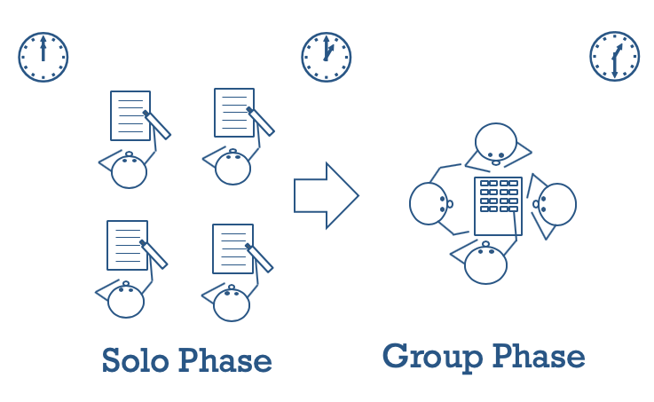
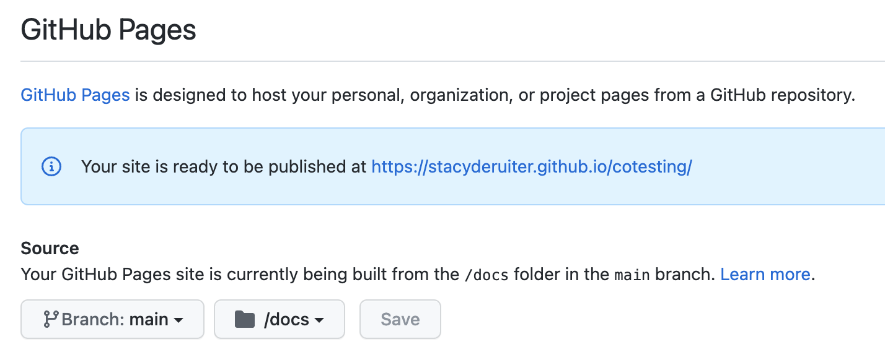
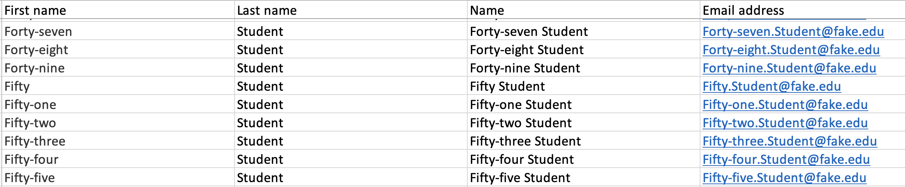
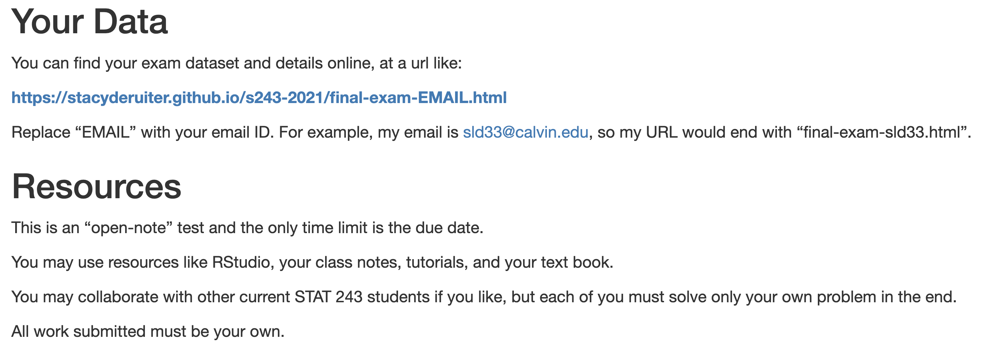
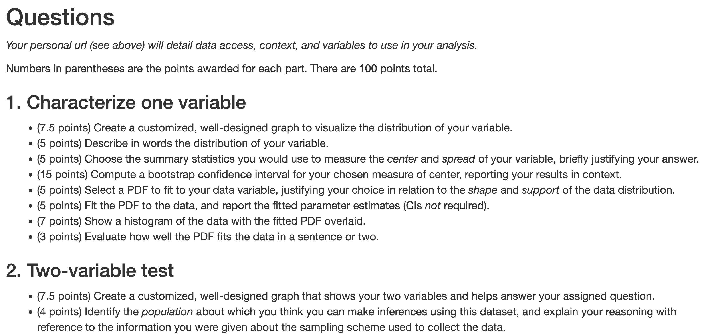
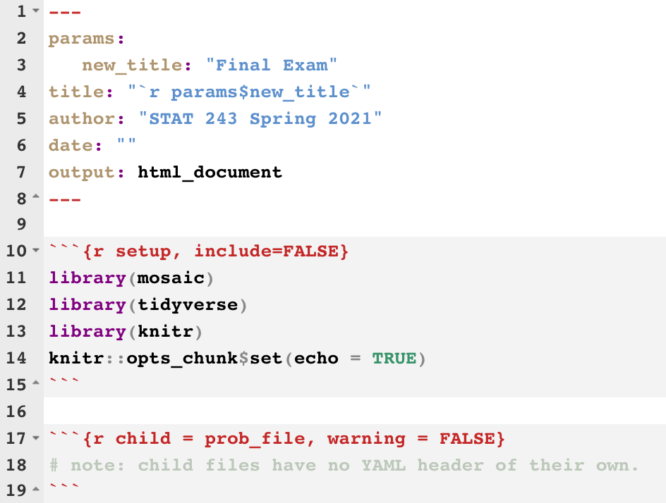
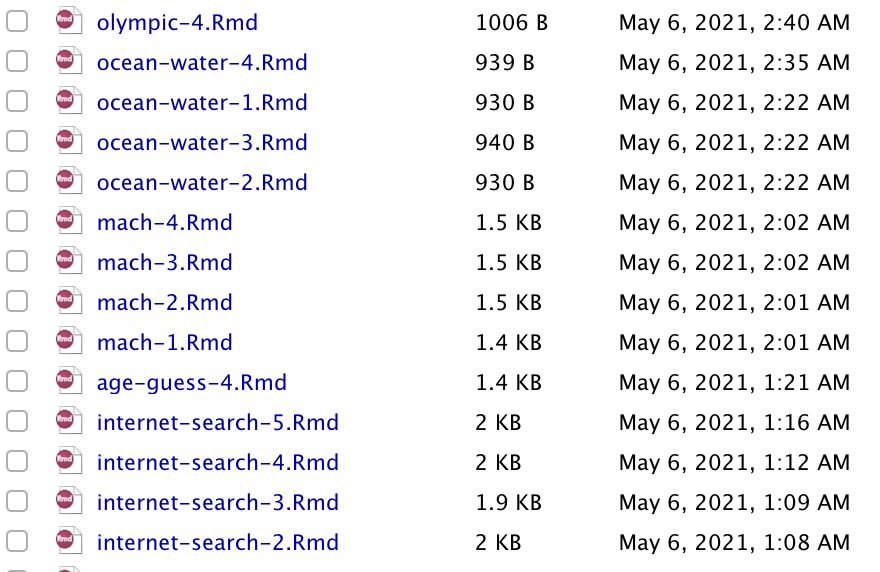
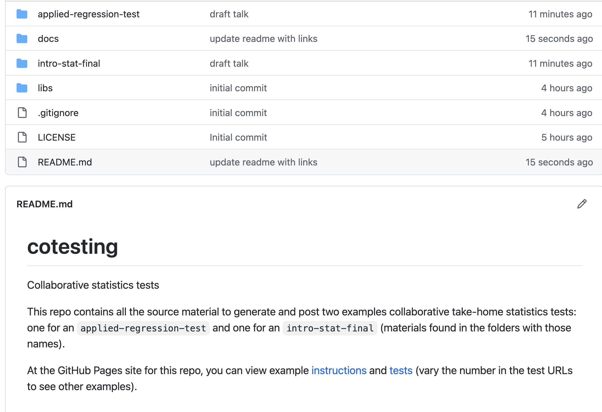

```{r setup, include=FALSE}
require(mosaic)
require(maxLik)
knitr::opts_chunk$set(echo = FALSE, out.width = '65%', fig.align='center')
```

# Motivation

.pull-left[
- Pandemic
- Virtual access
- Build community
- In-class group work
]

.pull-right[
```{r, out.width='100%'}
knitr::include_graphics('https://i0.wp.com/sahanjournal.com/wp-content/uploads/2020/09/DSC05700.jpg?w=1800&ssl=1')
```
]

<br>
.small[*Image: https://www.cristoreytc.org/apps/news/article/1293215*]
---
.smaller[

>> Kurt Schaefer, working from the premise that the Reformed tradition of ways of *knowing well* can inform faith-learning integration..., advances a thesis about the communal nature and ultimate motivations of the scientific project.

>> [there] might be an expectation to work “readily and joyfully for the service and enrichment” of others (Heidelberg Catechism, Q.55): dispositions and motives (Augustine’s “loves”) matter, and respectful and joyful cooperation animated by the Spirit is the evidence.

>> ...statistics is a discipline between disciplines, sometimes requiring expertise in multiple areas but even more often a willingness to engage, learn and communicate with others.

>> So to (re)form a data scientist adept at navigating these human elements, a welcoming community where communication and collaboration are expected and practiced, as part of the workload but also allowing for connections beyond it, is valuable. It is particularly important in the current moment where isolation and disconnection proliferate.

]

---
## Previous Work (*e.g.* [Rao *et al.* 2002](https://doi.org/10.1152/advan.00032.2001), [Newton *et al.* 2019](https://www.jstor.org/stable/26901301))
# 2-stage collaborative tests

```{r, echo = FALSE, out.width = '65%', fig.align='center'}

```

.smaller[*Image: Joss Ives, citls.lafayette.edu]

---
## My idea
# Collaborative Take-home

- One-week, take-home exam
- Each student works on their own dataset
- Questions are similar or identical
- Collaboration to "figure out" encouraged

---
##  Technical approach
# 1a. GitHub Repo

.center[
<https://cutt.ly/cotesting-repo>

```{r, out.width='30%'}

```

]

---
##  Technical approach
# 1b. GitHub Sites

```{r, out.width='85%'}

```

.small[
<https://stacyderuiter.github.io/cotesting/test2-Six.Student.html>
]

---
##  Technical approach
# 2. Student Info

```{r, out.width='97%'}

```

---
##  Technical approach
# 3. Global Instructions

```{r, out.width='97%'}

```

---
##  Technical approach
# 3. Global Instructions

```{r, out.width='97%'}

```

---
##  Technical approach
# 4. Master Test Rmarkdown

```{r, out.width='50%'}

```

---
##  Technical approach
# 5. Data (so much data)

```{r, out.width = '35%'}
knitr::include_graphics('https://www.sas.com/en_nz/insights/articles/big-data/big-data-privacy/_jcr_content/par02/image_df5.img.jpg/1457720090592.jpg')
```

.center[
.small[*Image: https://www.sas.com*]
]

---
##  Technical approach
# 6. Problem Rmarkdown files

```{r}

```

---
##  Technical approach
# 7. R script to generate tests

.small[
```{r, echo = TRUE, eval = FALSE}
for (s in c(1:nrow(student_emails))){
  student_id <- student_emails |> pull(short_email) |> nth(s)
  prob_file <- paste0('problems/', problem_files[s])
  render("final-exam-master.Rmd",
         output_file = paste0("individual-tests/final-exam-", student_id, ".html"),
         # note: will need to copy to docs folder to publish
         params = list(new_title = paste("Final Exam, STAT 243 for ", student_id)))
}
```
]

---
# Examples

- [Intro Stat Instructions](https://stacyderuiter.github.io/cotesting/test-2-instructions.html) and [test](https://stacyderuiter.github.io/cotesting/test2-Four.Student.html)
- [Applied Regression Instructions](https://stacyderuiter.github.io/cotesting/final-exam-instructions.html) and [test](https://stacyderuiter.github.io/cotesting/final-exam-One.Student.html)

---
# Fork my repo
## github.com/stacyderuiter/cotesting

.pull-left[
.small[.center[
<https://cutt.ly/cotesting-repo>
]]

```{r}

```
]

.pull-right[
<br>
```{r, out.width='100%'}

```
]

---
class: center inverse huge-subsection

# Survey...

<br>
<br>

# doesn't say

---
# + Reflections

- Students perform well
- Students collaborate productively!
- Collaboration & community reinforced?
- Students learn during testing
- Performance on BLIS steady
- Making the tests is kinda fun

---
# - Reflections

- "Unfair" questions?
- Writing = 2x standard take-home; marking same
- Large set of datasets needed (or built!)

---
# Thank you! 

.pull-left[
### <https://cutt.ly/cotesting-slides>

```{r}

```
]

.pull-right[
### <https://cutt.ly/cotesting-repo> 

```{r}

```
]

.center[
## sld33@calvin.edu
]
